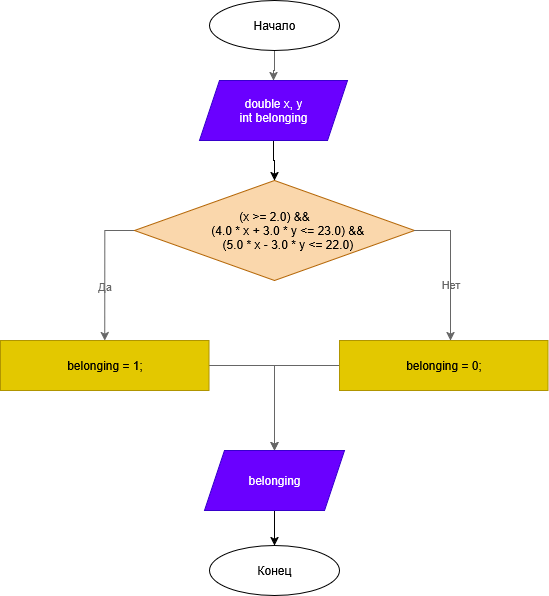

# Домашнее задание к работе 6

## Условие задачи
Составить программу, которая проверяет принадлежит ли заданная пользователем точка с координатами (х, у) заданным закрашенным (заштрихованным) областям, показанным на рисунке:


## 1. Алгоритм и блок-схема

### Алгоритм
1. **Начало**
2. Ввести координаты точки: `x` и `y`.
3. Переменной `belonging` задать результат выполнения всех трёх условий:
- `x >= 2`
- `4x + 3y <= 23`
- `5x − 3y <= 22`
4. Вывести соответствующее сообщение в зависимости от значения `belonging`
5. **Конец**

### Блок-схема


https://github.com/DragonSov/lab6_homework2/blob/master/schema.png

## 2. Реализация программы

```c
#include <stdio.h>
#include <locale.h>

int main(void) {
    setlocale(LC_CTYPE, "RUS");

    double x, y;
    int belonging;

    printf("Введите координаты точки x y: ");
    scanf("%lf %lf", &x, &y);

    belonging = (x >= 2.0) &&
        (4.0 * x + 3.0 * y <= 23.0) &&
        (5.0 * x - 3.0 * y <= 22.0);

    if (belonging)
    {
		printf("Точка (%.1f; %.1f) принадлежит заштрихованной области.\n", x, y);
    }
    else
    {
        printf("Точка (%.1f; %.1f) не принадлежит заштрихованной области.\n", x, y);
    }
    return 0;
}
```

## 3. Результаты работы программы


## 4. Информация о разработчике
Попов Станислав, бИПТ-252
